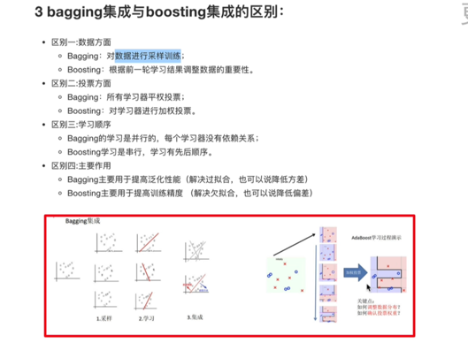
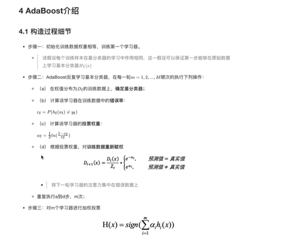
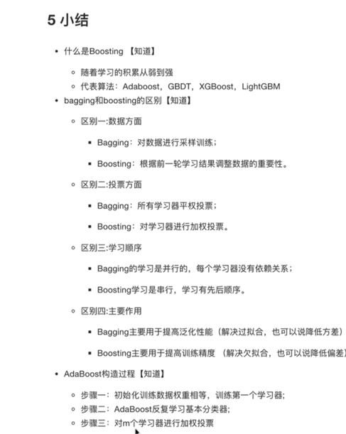

学习目标：
1.知道boosting集成原理和实现过程

2.知道bagging和boosting集成的区别

3.知道AdaBoosting集成原理

------

1.什么是boosting？
随着学习积累从弱到强。
简而言之：每新加入一个弱学习器，整体能力就会得到提升。
代表算法：adaboost  GBDT  XGBoost  LightGBM

-----------
4 AdaBoost介绍
4.1构造过程细节

