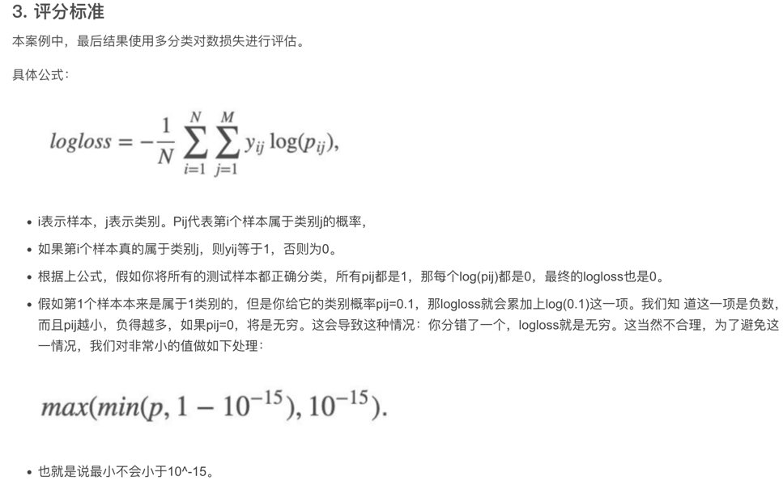

来自kaggle
https://www.kaggle.com/c/otto-group-product-classification-challenge/overview

数据集介绍
本案例中，数据集包含大约200,000种产品的93个特征。
其目的是建立⼀个能够区分otto公司主要产品类别的预测模型。
所有产品共被分成九个类别（例如时装，电子产品等）。

3.实现过程
获取数据
数据基本处理
     数据量比较大，尝试是否可以进⾏数据分割
     转换目标值表示方式
模型训练
     模型基本训练

转自:https://zhuanlan.zhihu.com/p/471494060
(侵权必删)